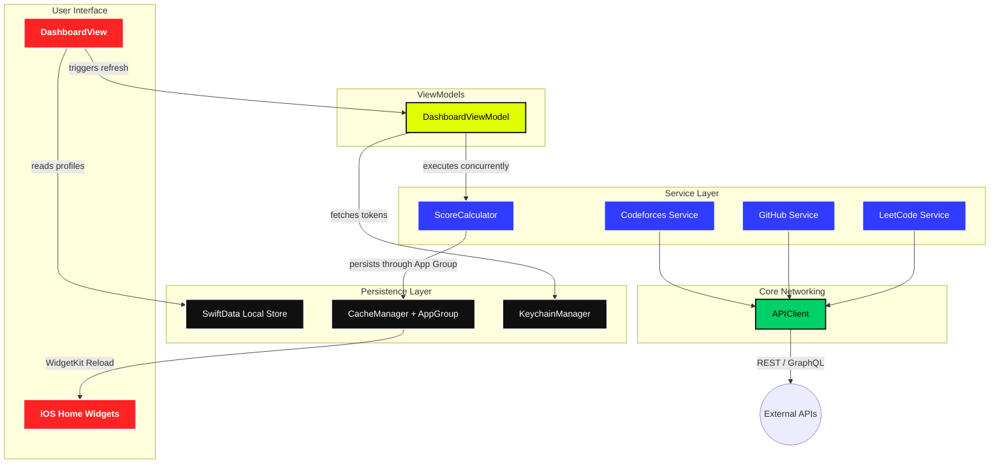
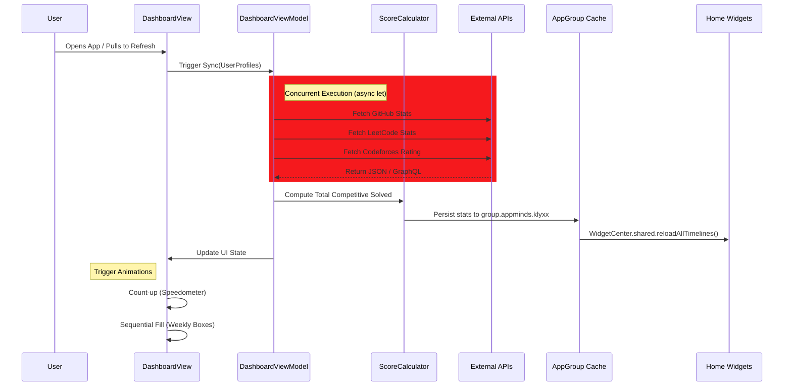

# Kłyx: Unified Developer Observability 🚀


**Kłyx** (pronounced *Clicks*) is a high-performance, visually aggressive iOS dashboard designed for developers who treat coding as a competitive sport. It aggregates live metrics from **GitHub**, **LeetCode**, and **Codeforces** into a unified technical profile, allowing you to track your growth with zero friction.

---

## 🖼️ Showcase
| | | |
|:---:|:---:|:---:|
|  |  |  |
|  |  |  |
|  |  |  |

---

## 🔥 Features

### 🖥️ High-Performance Dashboard
*   **Unified solved metrics:** Aggregates your Github commits, LeetCode solves, and Codeforces rating into a single master tier.
*   **Speedometer Animations:** Live count-up animations for your major metrics using custom `AnimatableModifier` protocols.
*   **Sequential Weekly Progress:** Watch your weekly LeetCode activity "fill in" with a smooth, staggered animation every time you open the dashboard.

### 📱 Native Home Screen Widgets
*   **GitHub Heatmap:** A professional, 7-row vertical activity matrix following the "Obsidion Noir" aesthetic.
*   **LeetCode Heatmap:** Optimized small and medium widgets with high-contrast grids and reduced padding for maximum visibility.
*   **Streak Tracking:** Dedicated widgets for monitoring your contribution habits without opening the app.

### 🎨 Brutalist "Noir" Aesthetic
*   **Hard-Matter UI:** Pure solid colors (`#F5191D`, `#FFDA27`, `#2F1FFD`) with no gradients or drop shadows.
*   **Clash Display Typography:** Heavy, high-impact weights that command attention.
*   **Tactile Feedback:** Spring-based interactions that make the "Bento Box" grid feel alive.

---

## 🧩 Widgets Library

Klyx features a robust suite of native iOS Home Screen widgets, built with **WidgetKit** and synchronized via a shared **App Group** pipeline.

### 📍 Streak Tracking (Small/Medium)
*   **Platform Focus:** Consolidates GitHub contributions and LeetCode solve streaks into a single, high-contrast glance.
*   **Design:** Uses the "Noir Red" and "Box Yellow" themes to signal activity health.

### 🗓️ GitHub Heatmap (Medium)
*   **Layout:** A standard 7-row vertical grid (Week-per-Column) providing a total of 140 days of history.
*   **Colors:** Utilizes "Obsidian Green" indicators on a pure black background for ultimate visual punch.
*   **Sizing:** Normalized 10pt boxes with precise spacing to match the desktop contribution graph.

### ⌨️ LeetCode Heatmap (Small/Medium)
*   **Layout:** A compact 6-column grid optimized for the `.systemSmall` family.
*   **Visuals:** Features "Emerald" activity layers over high-visibility dark-gray "empty" slots.
*   **Density:** Reduced padding ensures the complexity of your daily solve counts is preserved even on smaller screens.

### 📊 Weekly Progress (Small)
*   **Purpose:** Tracks your current week (Sunday-Saturday) performance.
*   **Logic:** Dynamically fills boxes based on daily activity counts stored in the shared data bridge. Useful for maintaining momentum throughout the work week.

---

## 🏗️ Architecture & Data Flow

Klyx utilizes a modernized MVVM architecture with strict service isolation and concurrent data fetching.



### 🔄 The Synchronization Pipeline

The app is designed to be reactive and "Concurrent-First." When the Dashboard appears, the following sequence occurs:



---

## 🏎️ Key Technical Decisions

1.  **Concurrent Parsing**: Uses `async let` to fetch data from all three platforms simultaneously. The app finishes as fast as the slowest API response.
2.  **Dependency Injection**: A centralized `ServiceContainer` manages all service instances. ViewModels receive a container rather than individual services, enabling one-line test swaps via `ServiceContainer.mock`.
3.  **App Group Bridge**: Widgets run in a separate sandbox process. We use an **App Group (`group.appminds.klyxx`)** to write JSON blobs to shared disk space that WidgetKit can pick up instantly.
4.  **Protocol-Driven Services**: Every platform service (`LeetCodeServiceProtocol`, `GitHubServiceProtocol`, `CodeforcesServiceProtocol`) is defined as a protocol with a production implementation and a mock. This enables full unit testing without network access.
5.  **Keychain Security**: GitHub Personal Access Tokens are encrypted in the system Keychain and only decrypted momentarily during a network request.

---

## 📂 Project Structure

```text
Klyx/
├── Core/
│   ├── Auth/
│   │   └── KeychainManager.swift          # Secure token storage via iOS Keychain
│   ├── Config/
│   │   ├── Constants.swift                # API URLs, cache TTLs, App Group ID
│   │   └── ServiceContainer.swift         # Centralized Dependency Injection container
│   ├── Extensions/
│   │   ├── Color+Hex.swift                # Hex string ↔ SwiftUI Color conversion
│   │   └── Date+Helpers.swift             # ISO formatting, streak calculation helpers
│   ├── Models/
│   │   ├── AggregatedStats.swift          # Unified cross-platform metrics model
│   │   ├── CodeforcesModels.swift         # CF API response types
│   │   ├── FriendProfile.swift            # Social leaderboard data model
│   │   ├── GitHubModels.swift             # GH API response types
│   │   └── LeetCodeModels.swift           # LC GraphQL response types
│   ├── Networking/
│   │   ├── APIClient.swift                # Generic async/await HTTP + GraphQL client
│   │   ├── CFEndpoints.swift              # Codeforces URL builder
│   │   ├── GHEndpoints.swift              # GitHub REST + GraphQL URL builder
│   │   └── LCEndpoints.swift              # LeetCode GraphQL queries
│   └── Persistence/
│       ├── CacheManager.swift             # App Group UserDefaults bridge
│       └── DataStore.swift                # SwiftData schema + migrations
├── Features/
│   ├── Competitive/
│   │   ├── CodeforcesView.swift           # CF rating charts and contest history
│   │   ├── CompetitiveViewModel.swift     # Tab state for LC/CF switching
│   │   └── LeetCodeView.swift             # LC problem breakdown and submissions
│   ├── Dashboard/
│   │   ├── DashboardView.swift            # Main Bento Box grid with animations
│   │   └── DashboardViewModel.swift       # Sync orchestration via ServiceContainer
│   ├── GitHub/
│   │   ├── ContributionHeatmapView.swift  # Full-screen contribution calendar
│   │   ├── GitHubView.swift               # Profile, repos, and follower stats
│   │   └── GitHubViewModel.swift          # GH-specific data management
│   ├── Profile/
│   │   ├── ProfileSetupView.swift         # Onboarding: username + token input
│   │   └── SettingsView.swift             # Account management and cache controls
│   ├── Services/
│   │   ├── CodeforcesService.swift        # CF API integration + mock
│   │   ├── GitHubService.swift            # GH REST/GraphQL integration + mock
│   │   ├── LeetCodeService.swift          # LC GraphQL integration + mock
│   │   └── ScoreCalculator.swift          # Concurrent aggregation engine
│   └── Social/
│       ├── AddFriendView.swift            # Friend search and addition
│       ├── FriendDetailView.swift         # Individual friend stat comparison
│       ├── SocialView.swift               # Leaderboard grid
│       └── SocialViewModel.swift          # Friend data management
├── Shared/
│   ├── Components/
│   │   ├── BentoCard.swift                # Base container for the Bento Box system
│   │   ├── HeatmapView.swift              # Reusable contribution grid renderer
│   │   ├── RankBadge.swift                # Codeforces rank indicator
│   │   ├── StatCard.swift                 # Numeric stat display card
│   │   └── WeeklyProgressView.swift       # Animated weekly progress tracker
│   ├── Theme/
│   │   ├── AppColors.swift                # Centralized color palette
│   │   ├── AppTypography.swift            # Typography scale definitions
│   │   ├── FontExtensions.swift           # Clash Display font integration
│   │   └── Fonts/                         # ClashDisplay .otf font files
│   └── Utilities/
│       └── AnimatableNumberModifier.swift  # Count-up animation modifier
├── KlyxWidget/                             # WidgetKit Extension Target
│   ├── HeatmapWidget.swift                # GitHub 7-row Noir heatmap
│   ├── LCHeatmapWidget.swift              # LeetCode activity grid
│   ├── StreakWidget.swift                  # Cross-platform streak tracker
│   ├── WeeklyWidget.swift                 # Weekly progress bars
│   ├── WidgetTheme.swift                  # Widget-specific App Group bridge
│   └── KlyxWidgetBundle.swift             # Widget registration + font loader
├── KlyxTests/
│   └── KlyxTests.swift                    # Unit tests for core business logic
└── RootView.swift                          # Tab bar navigation controller
```

---

## 🛠️ Tech Stack

| Layer | Technology | Purpose |
|:------|:-----------|:--------|
| **UI** | SwiftUI (iOS 18+) | Declarative interface with custom animations |
| **State** | `@Observable` (Observation) | Reactive state management without Combine |
| **Database** | SwiftData | Persistent user profiles and friend data |
| **Networking** | `URLSession` + `async/await` | Concurrent REST and GraphQL requests |
| **Persistence** | `UserDefaults` + App Group | Cross-process data sharing with WidgetKit |
| **Security** | Keychain Services | Encrypted storage for API tokens |
| **DI** | `ServiceContainer` | Protocol-based dependency injection |
| **Widgets** | WidgetKit | Native Home Screen data visualization |
| **Typography** | Clash Display (Custom) | Brutalist font system |
| **Testing** | Swift Testing (`@Test`) | Unit tests for models, services, and DI |

---

## 🧪 Testing

Klyx includes a unit test suite covering core business logic:

```bash
# Run all tests via Xcode
⌘ + U

# Test coverage includes:
# ✅ AggregatedStats computation and Codable round-trips
# ✅ Date helper formatting and streak calculations
# ✅ ServiceContainer DI (live vs mock verification)
# ✅ AppColors palette integrity
# ✅ APIError description coverage
```

---

## ⚠️ Building & Customization

> [!IMPORTANT]
> To ensure the Widgets can read your dashboard data, the app relies on a Shared App Group.

1.  **Xcode Setup**: Open `Klyx.xcodeproj` and select the primary `Klyx` target.
2.  **Signing & Capabilities**: Update the Bundle Identifier to your own domain and ensure the **App Groups** capability is active.
3.  **App Group ID**: By default, the app uses `group.appminds.klyxx`. Ensure this ID is added to both the `Klyx` and `KlyxWidgetExtension` targets.
4.  **API Tokens**: To view private GitHub stats or your detailed heatmap, enter a **GitHub PAT** in the app's settings. Public profiles work with just a username.
5.  **Run Tests**: Press `⌘ + U` to verify all business logic before making changes.

---

## 🔒 Privacy & Data
*   **Local Only**: Klyx is a client-first application. 100% of your data (usernames, tokens, and cached stats) stays on your device or in your private iCloud container.
*   **Zero Middle-Tier**: All API requests go directly from your phone to the platform providers (GitHub, LeetCode, Codeforces).

---

## 📝 License
Proudly built for the developer community. Distributed under the MIT License.
