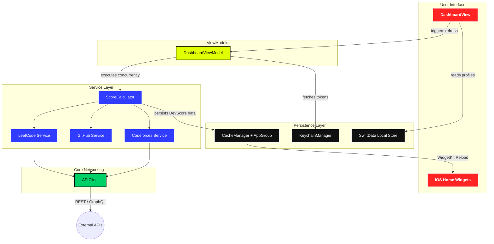

# Kłyx: The Ultimate Unified Developer Dashboard 🚀

Klyx is a high-performance, visually aggressive iOS application designed to track, aggregate, and visualize a developer’s true skill level. It pulls live coding statistics from **LeetCode**, **GitHub**, and **Codeforces**, computes a unified "DevScore", and displays everything in a heavy, solid-color, flat-matte aesthetic inspired by elite sports dashboards.

## 🔥 Key Features
- **Unified DevScore:** An algorithmic compilation of your Github commits, LeetCode solves, and Codeforces rating into a single master tier.
- **Aggressive "Box Box" Aesthetic:** Completely customized Swift UI framework relying on heavy, un-droppable typography (`.black` weights) and intensely saturated pure solid colors. No gradients, no glass, no fluff.
- **Live Widgets Pipeline:** Contains native iOS Home Screen widgets (`DevWidget`, `StreakWidget`, `HeatmapWidget`) functioning on an App Group bridged data cache.
- **Dynamic Heatmaps:** Custom built SVG/Grid parsing to render your activity calendar directly onto your dashboard.

## 🖼️ Showcase
| | | |
|:---:|:---:|:---:|
|  |  |  |
|  |  |  |
|  |  |  |

## 🏗️ Architecture & Data Flow 

Klyx utilizes a modernized MVVM architecture with strict, protocol-bound Service layers hitting high-throughput API Endpoints concurrently via Swift `async/await`.



## 🛠️ Project Structure
```text
Klyx/
├── Core/
│   ├── Auth/           # Keychain token preservation
│   ├── Config/         # Global endpoints / secrets
│   ├── Models/         # Codable targets for external APIs
│   ├── Networking/     # Central APIClient and URL Request dispatchers
│   └── Persistence/    # SwiftData Store and App Group UserDefault caches
├── Features/
│   ├── Dashboard/      # Main landing grid
│   ├── Competitive/    # LeetCode / Codeforces views
│   ├── GitHub/         # GitHub views
│   ├── Profile/        # Setup and Settings
│   └── Services/       # Business logic for platform parsing
├── Shared/
│   ├── Components/     # Base UI Elements (BentoCards, StatCards)
│   └── Theme/          # AppColors (The core palette)
└── KlyxWidget/         # Dedicated Target for Apple WidgetKit UI
```

## ⚠️ Building The App
To correctly compile Klyx and see the Home Screen Widgets functioning:
1. Open `Klyx.xcodeproj` in Xcode.
2. Select the `Klyx` target and navigate to **Signing & Capabilities**.
3. Ensure **App Groups** is enabled with `group.appminds.klyxx` selected.
4. Select the `KlyxWidgetExtension` target and ensure it possesses the exact same App Group.
5. If you do not enable the App Group, Sandbox restrictions will deliberately prevent the widgets from reading the DevScore.
6. **Tokens:** To populate the GitHub Heatmap, ensure you input a valid GitHub PAT (Personal Access Token) in the `ProfileSetupView`.
