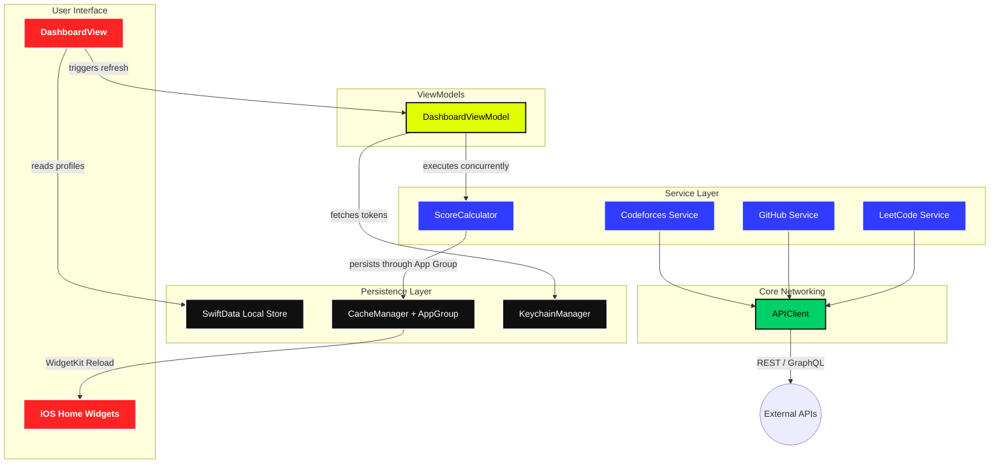

# Kłyx: Unified Developer Observability 🚀

**Kłyx** (pronounced *Clicks*) is a high-performance, visually aggressive iOS dashboard designed for developers who treat coding as a competitive sport. It aggregates live metrics from **GitHub**, **LeetCode**, and **Codeforces** into a single, master "DevScore," allowing you to track your technical growth with zero friction.

---

## 🖼️ Showcase
| | | |
|:---:|:---:|:---:|
|  |  |  |
|  |  |  |
|  |  |  |

---

## 🔥 Features

### 🖥️ High-Performance Dashboard
*   **DevScore Algorithm:** Calculates a composite score based on GitHub contributions, LeetCode problem difficulty, and Codeforces global rating.
*   **Speedometer Animations:** Live count-up animations for your major metrics using custom `AnimatableModifier` protocols.
*   **Sequential Weekly Progress:** Watch your weekly LeetCode activity "fill in" with a smooth, staggered animation every time you open the dashboard.

### 📱 Native Home Screen Widgets
*   **GitHub Heatmap:** A professional, 7-row vertical activity matrix following the "Obsidion Noir" aesthetic.
*   **LeetCode Heatmap:** Optimized small and medium widgets with high-contrast grids and reduced padding for maximum visibility.
*   **Streak Tracking:** Dedicated widgets for monitoring your contribution habits without opening the app.

### 🎨 Brutalist "Noir" Aesthetic
*   **Hard-Matter UI:** Pure solid colors (`#F5191D`, `#FFDA27`, `#2F1FFD`) with no gradients or drop shadows.
*   **Clash Display Typography:** Heavy, high-impact weights that command attention.
*   **Tactile Feedback:** Spring-based interactions that make the "Bento Box" grid feel alive.

---

## 🏗️ Architecture & Data Flow

Klyx utilizes a modernized MVVM architecture with strict service isolation and concurrent data fetching.

---

## 🛠️ Tech Stack
*   **UI Framework:** SwiftUI (iOS 17+)
*   **Database:** SwiftData for persistent user profiles.
*   **Persistence:** `UserDefaults` with App Group sharing for WidgetKit access.
*   **Networking:** Native `URLSession` with `async/await` and GraphQL support for LeetCode/GitHub.
*   **Security:** Keychain Services for protecting GitHub Personal Access Tokens.

---

## ⚠️ Building & Customization

> [!IMPORTANT]
> To ensure the Widgets can read your dashboard data, the app relies on a Shared App Group.

1.  **Xcode Setup**: Open `Klyx.xcodeproj` and select the primary `Klyx` target.
2.  **Signing & Capabilities**: Update the Bundle Identifier to your own domain and ensure the **App Groups** capability is active.
3.  **App Group ID**: By default, the app uses `group.appminds.klyxx`. Ensure this ID is added to both the `Klyx` and `KlyxWidgetExtension` targets.
4.  **API Tokens**: To view private GitHub stats or your detailed heatmap, enter a **GitHub PAT** in the app's settings. Public profiles work with just a username.

---

## 🔒 Privacy & Data
*   **Local Only**: Klyx is a client-first application. 100% of your data (usernames, tokens, and cached stats) stays on your device or in your private iCloud container.
*   **Zero Middle-Tier**: All API requests go directly from your phone to the platform providers (GitHub, LeetCode, Codeforces).

---

## 📝 License
Proudly built for the developer community. Distributed under the MIT License.
